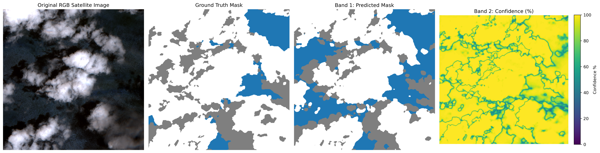

Here we develop an end-to-end AI solution for cloud and cloud shadow masking from multi-spectral satellite imagery. The data to be used is a subset from the CloudSen12+ dataset. 

From this dataset, which contains four classes: Clear (0), Thick Cloud (1), Thin Cloud (2), and Cloud Shadow (3), we want to develop a semantic segmentation model that classifies every pixel into

| Label | Class Name | Description |
|---|---|---|
| 0 | Clear | Clear |
| 1 | Cloud | Cloud |
| 2 | Cloud Shadow | Cloud Shadow  |

Thus a remapping must be done. Clear --> (0), Thick and Thin Cloud --> (1), and Cloud Shadow --> (2).  

We made use of a Double Convolution Neural Network and a U-Net architecture. We evaluated are results using IoU, Dice, Precision, and Recall. 

## Sample Output

## Post Training Analysis

| Class | IoU | Dice/F1 | Precision | Recall |
| :--- | :--- | :--- | :--- | :--- |
| Clear (0) | 0.867897 | 0.929277 | 0.922046 | 0.936623 |
| Cloud (1) | 0.810666 | 0.895434 | 0.934409 | 0.859580 |
| Cloud Shadow (2) | 0.612633 | 0.759792 | 0.689530 | 0.845998 |
| Macro Average | 0.763732 | 0.861501 | 0.848662 | 0.880734 |

- High Macro Dice and Recall translates to strong generalization across all target classes. 
- Clear sky - High Dice and Recall, Cloud - High Dice and Precision.
- Cloud Shadow - Relatively low performance.
